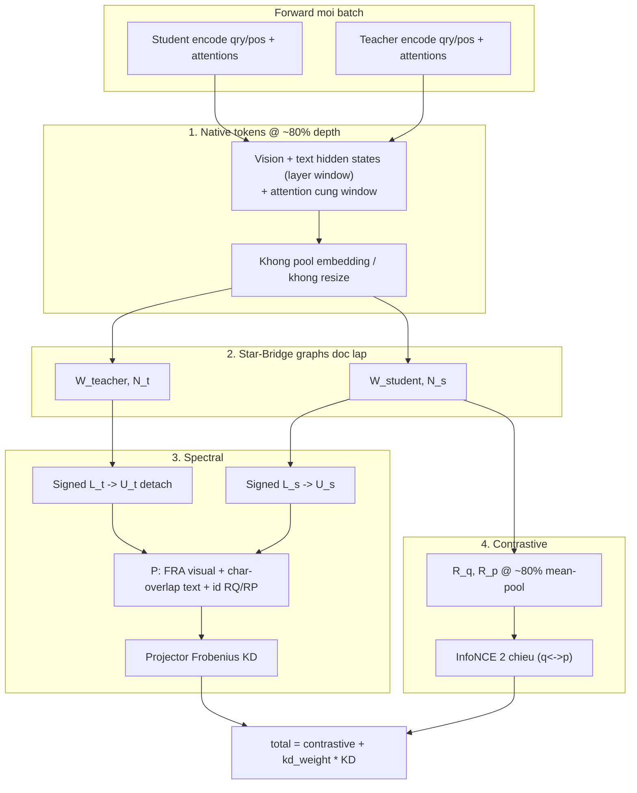

# SEGDLoss — Spectral Knowledge Distillation với Cross-sample Star-Bridge Graph

Tài liệu theo dõi cấu trúc loss hiện tại của [`src/criterions/segd_loss.py`](../src/criterions/segd_loss.py).

Phương pháp: xây **hai graph Star-Bridge độc lập** (Teacher / Student) ở **cấp batch**, lấy eigenspace của signed Laplacian, chiếu Teacher về khung Student bằng ma trận projection fractional (FRA visual + char-overlap text), rồi distill bằng **subspace projector matching**. Contrastive tái sử dụng mean-pooled super-node reps của Student.

Script train mẫu: [`scripts/cls/train_SEGD_fastvlm.sh`](../scripts/cls/train_SEGD_fastvlm.sh)

---

## Công thức tổng

```
loss = contrastive_loss + kd_weight * spectral_kd_loss
```

| Thành phần | Trọng số mặc định | Mô tả ngắn |
|------------|-------------------|------------|
| `contrastive_loss` | 1.0 (implicit) | Symmetric InfoNCE (q→p + p→q) trên `encode_input` pooling student (mặc định `--pooling mean`) |
| `spectral_kd_loss` / `segd_loss` | `kd_weight` | Frobenius giữa subspace projectors sau chiếu qua $P$ |

**Không còn:** CKA, Semantic Grounding, per-sample SEKD cũ (kNN + post-spectral $H_0\times W_0$ / word-level align), RKD, DBSCAN.

---

## Luồng tính toán tổng thể

```
[Teacher forward] ─┐
                    ├─> Native tokens @ ~80% hidden + attention ─> Graph (batch) ─> Signed Laplacian ─> eigh ─┐
[Student forward] ─┘                                                                                        ├─> P^T U_t vs U_s (KD)
                    ├─> Spans / (H,W) for P (chỉ lúc KD) ───────────────────────────────────────────────────┘
                    └─> R_q, R_p (mean-pool @ ~80% hidden) ──────────────────────────────────────────────> InfoNCE 2 chiều
```



---

## 1. Token matching — giữ native tokens (tổng quan)

**Nguyên tắc chung:** Teacher và Student **không** ép cùng số node, không pool embedding trước khi build graph. Mỗi bên giữ đúng token đã đi qua forward pass:

- **Vision:** $N_v^t = H_t W_t$, $N_v^s = H_s W_s$ patch gốc.
- **Text:** $N_{\text{text}}^t$, $N_{\text{text}}^s$ subword gốc (tokenizer riêng).

Sự tương ứng Teacher ↔ Student **chỉ** được định nghĩa ở bước **cross-model projection** $P$ (mục 3.4), sau khi đã có eigenvector $U_t, U_s$. Graph và embedding gốc **không** bị biến đổi bởi $P$.

**Node embedding** (vision + text trong graph, và $R_q,R_p$) + **attention intra** đều từ **cùng layer window ~80%** — xem mục 2.

---

## 1A. Mapping sequence → node graph (trong từng model)

Trước khi nói FRA / char-overlap, cần rõ **node graph lấy từ đâu** trong chuỗi transformer.

### 1A.1 Layout chuỗi Teacher vs Student

| Bên | Padding | Thứ tự token trong sequence |
|-----|---------|----------------------------|
| **Teacher** (left pad) | Trái | `[pad … pad \| vision \| text]` |
| **Student** (right pad) | Phải | `[vision \| text \| pad … pad]` |

Với sample $i$, gọi $S$ = `seq_len`, $N_v$ = số vision patch, $N_t$ = số text subword.

**Teacher — absolute index trong attention matrix:**

$$
\mathcal{I}^{\text{vis}}_T = \{S - N_t - N_v,\; \ldots,\; S - N_t - 1\}, \qquad
\mathcal{I}^{\text{txt}}_T = \{S - N_t,\; \ldots,\; S - 1\}
$$

**Student:**

$$
\mathcal{I}^{\text{vis}}_S = \{0,\; 1,\; \ldots,\; N_v - 1\}, \qquad
\mathcal{I}^{\text{txt}}_S = \{N_v,\; \ldots,\; N_v + N_t - 1\}
$$

**Cluster node index** (local, trong 1 cụm qry hoặc pos):

$$
\underbrace{0,\ldots,N_v-1}_{\text{vision}},\;
\underbrace{N_v,\ldots,N_v+N_t-1}_{\text{text}}
$$

Attention intra-cluster: slice ma trận full-seq $A \in \mathbb{R}^{S\times S}$:

$$
A^{\text{cluster}} = A[\mathcal{I}, \mathcal{I}], \quad \mathcal{I} = \mathcal{I}^{\text{vis}} \cup \mathcal{I}^{\text{txt}}
$$

Không pool / coarsen $A$ trước slice — đây là attention **native** trên đúng token đã forward. $A^{\text{cluster}}$ chỉ dùng để **chọn top-k neighbor**; trọng số cạnh intra tính từ **hidden states** cùng layer window (mục 3.2).

### 1A.2 Infer lưới vision $(H, W)$ từ $N_v$

FRA cần $(H_t, W_t)$ và $(H_s, W_s)$. Code dùng `infer_spatial_hw`:

1. Nếu $N_v = s^2$ (số chính phương) → $(H,W) = (s,s)$.
2. Nếu có `image_sizes` + `patch_size` → thử $(\lfloor H_{\text{img}}/p \rfloor,\; \lfloor W_{\text{img}}/p \rfloor)$.
3. Nếu không khớp → factorization gần aspect ratio nhất.
4. Fallback: factor lớn nhất $\le \sqrt{N_v}$.

Patch index trong cluster (row-major):

$$
\text{patch\_idx}(h, w) = h \cdot W + w, \quad h \in [0,H),\; w \in [0,W)
$$

---

## 1B. Text mapping — Character-overlap (chi tiết)

### 1B.1 Tại sao không pool xuống word-level

Nếu pool subword → word trước graph, node intra-cluster không còn là token thật → attention giữa các node chỉ là **tổng hợp** (coarsening), không phải attention 100% của model. Text giữ native subword để đối xứng với visual (FRA cũng không pool patch).

### 1B.2 Lấy character span từ tokenizer

Với cùng **câu gốc** $x$ (sau `strip_vlm_image_markers`), mỗi bên tokenize và lấy `offset_mapping`:

$$
\text{token}_i^T \leftrightarrow [s_i^t, e_i^t), \quad
\text{token}_j^S \leftrightarrow [s_j^s, e_j^s)
$$

Offsets được build qua `build_paired_text_offsets`: thử `reference_text` chung, verify token IDs khớp chính xác với `input_ids` đã forward. **Hệ tọa độ ký tự phải chung** — đây là điều kiện để overlap có nghĩa.

### 1B.3 Ma trận overlap thô

$$
O^{\text{text}}_{ij}
= \bigl|[s_i^t, e_i^t) \cap [s_j^s, e_j^s)\bigr|
= \max\!\bigl(0,\; \min(e_i^t, e_j^s) - \max(s_i^t, s_j^s)\bigr)
$$

Ma trận $O^{\text{text}} \in \mathbb{R}^{N_t^{\text{tok}} \times N_s^{\text{tok}}}$, **không** đối xứng, **không** bắt buộc sparse (nhưng thực tế sparse vì span gần nhau).

**Ví dụ** — câu `"the ball is red"`, Teacher gộp `"ball is"` → 1 token span $[4,10)$, Student tách `"ball"`, `"is"`:

| Teacher token | Span | Overlap với Student |
|---------------|------|---------------------|
| `"ball is"` | $[4,10)$ | `"ball"` $[4,8)$ → 4 chars; `"is"` $[9,11)$ → 1 char |

$$
O^{\text{text}} = \begin{bmatrix} \cdots \\ 4 & 1 \\ \cdots \end{bmatrix}
\quad\text{(hàng Teacher token gộp)}
$$

Không cần khái niệm "word" trung gian.

### 1B.4 Chuẩn hoá hàng (dùng trong $P$)

Mỗi **hàng Teacher** phân phối trọng số sang Student (chiếu Teacher → khung Student):

$$
\tilde{O}^{\text{text}}_{ij}
= \frac{O^{\text{text}}_{ij}}{\sum_{j'} O^{\text{text}}_{ij'} + \varepsilon},
\quad \varepsilon = 10^{-8}
$$

**Fallback hàng rỗng** (token Teacher không overlap token Student nào — hiếm nếu offsets đúng):

$$
\text{nếu } \sum_j O^{\text{text}}_{ij} = 0
\;\Rightarrow\;
\tilde{O}^{\text{text}}_{i,:} = \frac{1}{N_s^{\text{tok}}} \mathbf{1}^{\top}
$$

**Fallback offsets thiếu / lệch length** (không build được char span):

$$
\tilde{O}^{\text{text}} = \frac{1}{N_s^{\text{tok}}} \mathbf{1}_{N_t} \mathbf{1}_{N_s}^{\top}
\quad\text{(uniform many-to-many)}
$$

### 1B.5 Gắn vào $P$ — khối text

Với sample $i$, cụm query, offset text Teacher bắt đầu tại `t_off["text"]`, Student tại `s_off["text"]`:

$$
P_{\,t\_off[\text{text}] + i,\; s\_off[\text{text}] + j} = \tilde{O}^{\text{text}}_{ij}
$$

Tương tự cho **cụm positive** với offsets `text_p` và spans riêng của positive.

---

## 1C. Visual mapping — Fractional Region Alignment (FRA, chi tiết)

### 1C.1 Không gian chuẩn hoá

Giả sử ảnh (sau crop/resize policy) được map vào **đơn vị vuông chuẩn** $[0,1]^2$. Teacher lưới $H_t \times W_t$, Student $H_s \times W_s$ — **cùng vùng ảnh**, khác độ mịn.

**Điều kiện bắt buộc:** hai pipeline resize không lệch tâm / crop khác nhau. FRA chỉ mô hình hóa geometry lưới, không sửa lệch preprocessing.

### 1C.2 Overlap 1D trên một trục

Chia $[0,1]$ thành $N_t$ ô Teacher và $N_s$ ô Student đều nhau:

$$
\text{cell}_i^T = \left[\frac{i}{N_t},\; \frac{i+1}{N_t}\right), \quad
\text{cell}_j^S = \left[\frac{j}{N_s},\; \frac{j+1}{N_s}\right)
$$

Độ dài giao nhau (công thức đóng, không lặp):

$$
O^{(1)}_{ij}
= \max\!\left(0,\; \min\!\left(\frac{i+1}{N_t}, \frac{j+1}{N_s}\right) - \max\!\left(\frac{i}{N_t}, \frac{j}{N_s}\right)\right)
$$

Code (`axis_overlap_matrix`): `linspace(0,1,N+1)` → `lo = max(start_t, start_s)`, `hi = min(end_t, end_s)`, `O = (hi-lo).clamp(min=0)`.

### 1C.3 Overlap 2D = tích hai trục độc lập

Patch Teacher $(h_t, w_t)$ và Student $(h_s, w_s)$ là hình chữ nhật trong $[0,1]^2$. Vì hai lưới căn đều và cùng phủ $[0,1]^2$, diện tích giao = tích overlap theo $H$ và $W$:

$$
O^{\text{vis}}_{(h_t,w_t),\,(h_s,w_s)}
= O^{(H)}_{h_t h_s} \cdot O^{(W)}_{w_t w_s}
$$

Flatten row-major (vision index trong cluster):

$$
\text{idx}_T = h_t W_t + w_t, \quad \text{idx}_S = h_s W_s + w_s
$$

$$
O^{\text{vis}} \in \mathbb{R}^{(H_t W_t) \times (H_s W_s)}
$$

Implementation:

```python
Oh = axis_overlap_matrix(H_t, H_s)   # (H_t, H_s)
Ow = axis_overlap_matrix(W_t, W_s)   # (W_t, W_s)
O  = einsum('hi,wj->hwij', Oh, Ow).reshape(H_t*W_t, H_s*W_s)
```

### 1C.4 Bảo toàn diện tích (sanity check)

Diện tích mỗi cell Teacher = $1/(H_t W_t)$, Student = $1/(H_s W_s)$.

$$
\sum_{j} O^{\text{vis}}_{ij} = \frac{1}{H_t W_t}, \quad \forall i
\qquad
\sum_{i} O^{\text{vis}}_{ij} = \frac{1}{H_s W_s}, \quad \forall j
$$

**Ví dụ** $9\times9$ vs $16\times16$: $O \in \mathbb{R}^{81 \times 256}$. Mỗi hàng Teacher sum $= 1/81 \approx 0.01235$; mỗi cột Student sum $= 1/256 = 0.00390625$. Trung bình mỗi patch Teacher overlap $\approx (16/9)^2 \approx 3.2$ patch Student.

### 1C.5 Chuẩn hoá hàng cho $P$

Giống text — chiếu **từ Teacher sang Student**:

$$
\tilde{O}^{\text{vis}}_{ij}
= \frac{O^{\text{vis}}_{ij}}{\sum_{j'} O^{\text{vis}}_{ij'} + \varepsilon}
$$

Ý nghĩa: eigenvector Teacher tại node vision $i$ được **tái tổng hợp** thành convex combination các node vision Student liên quan, trọng số = tỷ lệ diện tích giao.

**Fractional, không binary:** patch Student vắt biên 2 vùng Teacher nhận trọng số theo đúng diện tích giao — không gán cứng theo tâm patch.

### 1C.6 Gắn vào $P$ — khối visual

$$
P_{\,t\_off[\text{visual}] + \text{idx}_T,\; s\_off[\text{visual}] + \text{idx}_S}
= \tilde{O}^{\text{vis}}_{\text{idx}_T,\,\text{idx}_S}
$$

Query cluster dùng $(H_t,W_t)$ từ query (fallback positive nếu query không có ảnh: `tq["H"] or tp["H"]`). Positive cluster dùng $(H_t^p,W_t^p)$ riêng; nếu positive không có ảnh → fallback grid query (`H_t^p or H_t`).

### 1C.7 Tại sao không cần GCD / canonical grid

FRA đúng với **mọi** $(H_t,W_t,H_s,W_s)$, kể cả $\gcd=1$. GCD-exact chỉ là trường hợp $O^{\text{vis}}$ suy biến về block đều. Không có ngưỡng grid tối thiểu.

---

## 1D. CLS / register / super-node

| Loại node | Mapping trong $P$ |
|-----------|-------------------|
| CLS / register (nếu có) | $P_{i,i} = 1$ (identity 1–1) |
| Super-node $R_Q^{(i)}$ | $P_{\,idx_{RQ}^T(i),\, idx_{RQ}^S(i)} = 1$ |
| Super-node $R_P^{(i)}$ | $P_{\,idx_{RP}^T(i),\, idx_{RP}^S(i)} = 1$ |

Backbone hiện tại (Qwen2-VL teacher, LLaVA-Qwen2 student): **không** có CLS riêng trong cluster — chỉ `[vision | text]`.

### 1E. Luồng mapping end-to-end (tóm tắt)

```
Câu gốc x + ảnh I
        │
        ├─ Teacher tokenizer ──► spans_t[i] = [s_i^t, e_i^t)     ──┐
        └─ Student tokenizer ──► spans_s[j] = [s_j^s, e_j^s)     ──┤
                                                                  ├─► O^text, Õ^text ──► P[text block]
        ├─ Teacher patches H_t×W_t trên [0,1]²                  ──┤
        └─ Student patches H_s×W_s trên [0,1]²                  ──┴─► O^vis, Õ^vis ──► P[visual block]

Forward native ──► Graph W (index native) ──► L ──► U
                                                      │
                              P^T U_t ──────────────────┼──► L_KD vs U_s
                              (chỉ tại loss)          │
```

| Bước | Input | Output | Khi nào |
|------|-------|--------|---------|
| Extract tokens | `hidden_states` @ ~80% window | $h_v, h_t$ native | Mỗi (sample, qry/pos, model) |
| Slice attention | full-seq $A$ @ cùng window | $A^{\text{cluster}}$ | Build $W$ intra |
| Build $W$ | hidden, $A$ (topology), $R$ | $W \in \mathbb{R}^{N\times N}$ | Per model, batch; cosine softmax weights |
| Eigendecomp | $L$ | $U \in \mathbb{R}^{N\times k}$ | Per model |
| Build $P$ | spans, $(H,W)$, offsets | $P \in \mathbb{R}^{N_T \times N_S}$ | **Sau** eigh, chỉ KD |
| Project | $U_t, P$ | $U_t^{\mathrm{proj}} = P^{\top} U_t$ | KD loss |

---

## 2. Layer ~80% depth — hidden states và attention (cùng window)

Cả **node embedding** (graph + mean-pool $R_q,R_p$) và **attention intra-cluster** đều lấy từ **cùng cửa sổ layer** quanh $0.8 \times (L-1)$:

```python
idxs = get_target_layer_indices(L, depth_ratio=0.8, window=1)  # mac dinh 3 layer
hidden = mean(hidden_states[i] for i in idxs)   # (B, S, D)
attn   = mean(mean_heads(attentions[i]) for i in idxs)  # (B, S, S)
```

- `get_target_layer_hidden_smoothed` → extract vision/text tokens → node trong graph
- `get_target_layer_attn_smoothed` → slice cluster indices → cạnh intra
- **Không** dùng last layer cho graph / $R_q,R_p$ (tránh mismatch attention vs embedding)

Layer cuối thường spike vào CLS/EOS → graph gần rời rạc nếu dùng attention cuối; hidden cuối cũng sharpen khác ~80%.

**Không** pool / coarsen attention trước slice cluster. Nếu `attentions is None` → fallback: dùng **cosine similarity** trên cùng hidden @ ~80% để chọn top-k neighbor (vẫn weight bằng cosine softmax trên hidden).

Metric log: `segd_attn_layer` = layer center của window (từ attention path nếu có, else từ hidden path).

---

## 3. Build Graph cấp Batch (Star-Bridge)

Teacher và Student được đánh index **độc lập**. $N_{\text{total}}^t \neq N_{\text{total}}^s$ là bình thường.

### 3.1 Global indexing (chi tiết)

#### 3.1.1 Ký hiệu

Batch size $B$. Sample $i \in \{0,\ldots,B-1\}$:

- $N_{q,i}$ = số node trong cụm **query** sample $i$ (vision + text native)
- $N_{p,i}$ = số node trong cụm **positive** sample $i$

Mỗi cụm layout: $[\text{vision}_{0..N_v-1} \mid \text{text}_{0..N_t-1}]$, với $N_{q,i} = N_{v,q,i} + N_{t,q,i}$.

#### 3.1.2 Offset tích lũy

```python
cursor = 0
for i in range(B):
    off_q[i] = cursor;  cursor += N_{q,i}
    off_p[i] = cursor;  cursor += N_{p,i}
RQ_start = cursor;  cursor += B    # B super-node R_Q
RP_start = cursor;  cursor += B    # B super-node R_P
N_total = cursor
```

**Global index:**

| Node | Global index (sample $i$) |
|------|---------------------------|
| Query cluster, local $k$ | `off_q[i] + k` |
| Positive cluster, local $k$ | `off_p[i] + k` |
| Super-node $R_Q^{(i)}$ | `RQ_start + i` |
| Super-node $R_P^{(i)}$ | `RP_start + i` |

$$
N_{\text{total}} = \sum_{i=0}^{B-1}(N_{q,i} + N_{p,i}) + 2B
$$

#### 3.1.3 Ví dụ cụ thể ($B=2$)

Giả sử:

| Sample | $N_{q}$ (vis+txt) | $N_{p}$ (vis+txt) |
|--------|-------------------|-------------------|
| 0 | $81+12=93$ | $81+10=91$ |
| 1 | $256+15=271$ | $256+14=270$ |

$$
N_{\text{total}} = (93+91) + (271+270) + 4 = 729
$$

Index map (rút gọn):

```
[0 .. 92]     = Q_0 cluster
[93 .. 183]   = P_0 cluster
[184 .. 454]  = Q_1 cluster
[455 .. 724]  = P_1 cluster
[725]         = R_Q^{(0)}
[726]         = R_Q^{(1)}
[727]         = R_P^{(0)}
[728]         = R_P^{(1)}
```

Teacher và Student có **cùng cấu trúc topology** (cùng $B$, cùng số cụm) nhưng $N_{q,i}, N_{p,i}$ **khác nhau** → $N_{\text{total}}^T \neq N_{\text{total}}^S$.

#### 3.1.4 Local offset trong cụm (cho $P$)

Trong 1 cụm, vision bắt đầu local index 0, text bắt đầu $N_v$:

$$
\text{global} = \text{cluster\_start} + \begin{cases}
h W + w & \text{vision patch } (h,w) \\
N_v + j & \text{text subword } j
\end{cases}
$$

### 3.2 Nguyên tắc gán trọng số cạnh

> **Attention determines graph topology, while cosine similarity determines edge affinity.**

Attention (forward pass, layer ~80% depth) **chỉ dùng để chọn tập hàng xóm** (neighbor selection) cho cạnh intra-cluster. **Toàn bộ trọng số cạnh** — cả 3 loại (intra-cluster, local-to-global, bridge) — đều tính lại bằng **cosine similarity + softmax normalize cục bộ** trên đúng tập candidate của node đó. Không có nơi nào dùng attention hay hằng số $1/n$ làm giá trị cạnh cuối cùng.

**Lý do:**
1. **Cân bằng scale** — cả 3 loại cạnh đều là $\mathrm{softmax}(\cos/\tau)$ trên candidate set riêng → cùng bậc magnitude, không cần hệ số $\beta$ hiệu chỉnh thủ công.
2. **Đảm bảo gradient** — attention từ HuggingFace thường detach (SDPA/flash-attn); dùng nó làm weight sẽ mất grad. Attention giờ chỉ chọn index (rời rạc, `no_grad`); weight tính từ `hidden_states` (luôn có grad) → toàn bộ $W$ student truyền gradient.

**Công thức thống nhất** (áp dụng giống nhau cho Teacher và Student — build độc lập):

$$
w_{ij} = \frac{\exp\bigl(\cos(x_i, x_j)/\tau\bigr)}{\displaystyle\sum_{k \in \mathcal{N}(i)} \exp\bigl(\cos(x_i, x_k)/\tau\bigr)}, \qquad j \in \mathcal{N}(i)
$$

Ba loại cạnh **chỉ khác nhau ở cách chọn $\mathcal{N}(i)$**:

| Cạnh | Giữa | $\mathcal{N}(i)$ | $\tau$ | Ghi chú |
|------|------|------------------|--------|---------|
| **Intra-cluster** | token ↔ token (cùng cụm) | Top-k theo **attention** @ ~80% | `segd_tau_intra` | Attention chỉ chọn index, không dùng làm weight |
| **Local-to-global** | token ↔ super-node cụm | **Toàn bộ** token hợp lệ trong cụm | `segd_tau_local` | $R$ vẫn là mean-pool thật; chỉ **weight cạnh** đổi |
| **Bridge** | $R_Q$ ↔ $\{R_P, R_{\text{Neg}}\}$ | $\{\text{Pos}\} \cup$ top-k hard-neg theo **cosine** | `segd_bridge_temperature` | Positive luôn trong candidate; neg nhận dấu âm thủ công |

**Topology:**
- Mỗi cụm có 1 đại diện $R$ = mean-pool token hợp lệ @ ~80% hidden.
- Query nối Positive **và** hard-negatives (Positive khác trong batch).
- **Không** có cạnh Query–Query hay Positive–Positive.

**Không cần ReLU trước softmax:** $\exp(\cdot)$ luôn dương dù cosine âm — softmax đảm bảo $w_{ij} > 0$. Dấu âm ở bridge-negative là **chủ đích thiết kế** (repulsion trong signed Laplacian), gán thủ công sau softmax: $w_{\text{neg}} = -\lambda_{\text{neg}} \cdot \alpha$.

**Symmetrize toàn cục** (một lần sau khi gộp cả 3 loại cạnh):

$$
W \leftarrow \tfrac{1}{2}(W + W^{\top})
$$

Intra-cluster top-k theo attention **không đối xứng** ($j \in \mathcal{N}(i)$ chưa chắc $i \in \mathcal{N}(j)$). Symmetrize sau cùng có thể làm row-sum lệch nhẹ khỏi 1.0 — chấp nhận được vì Laplacian normalization ($D^{-1/2}WD^{-1/2}$, $D_{ii}=\sum_j|W_{ij}|$) tự re-scale theo degree thực tế.

#### 3.2.1 Chi tiết từng loại cạnh

**Intra-cluster** — `_build_attn_topk_index` chọn neighbor, `_cosine_softmax_weight` gán weight:

```python
# attention: chỉ index (no_grad)
topk_idx = _build_attn_topk_index(attn_cluster, mask, k=segd_intra_topk)
# weight: cosine + softmax trên hidden @ cùng layer window
w = softmax(cos(hidden[i], hidden[neighbors]) / tau_intra)
```

**Local-to-global** — candidate = mọi token hợp lệ; trọng tâm $x_i = R$ (super-node):

```python
w = softmax(cos(R, hidden[valid_tokens]) / tau_local)   # sum = 1
```

**Bridge** — cosine (L2-normalize $R_q, R_p$), không scaled dot-product $1/\sqrt{d}$:

$$
\text{logits}_{ij} = \frac{\cos(R_{Q_i}, R_{P_j})}{\tau_{\text{bridge}}}, \quad
\alpha = \mathrm{softmax}\bigl(\text{logits}_{\{pos\}\cup\text{topk-neg}}\bigr)
$$

Hard-negative: top-k theo cosine trong batch (không theo attention). Positive $i$ luôn nằm trong candidate dù không lọt top-k neg.

### 3.3 Assembly

`assemble_graph` chạy **2 lần độc lập** (Teacher `no_grad`, Student giữ grad). Thứ tự mỗi sample: mean-pool $R_q, R_p$ → intra (qry + pos) → local-to-global (qry + pos) → sau vòng batch: bridge. Edge values giữ trong autograd (không `.item()`). `_DiffEdgeBuffer.to_dense()` gộp sparse COO, **symmetrize một lần** $W = \frac{1}{2}(W+W^\top)$, trả dense $W$, $N_{\text{total}}$, $R_q$, $R_p$.

### 3.4 Cross-model projection $P$ (chi tiết đầy đủ)

Đây là bước **duy nhất** nối không gian spectral Teacher ($N_t$ node) với Student ($N_s$ node) khi $N_t \neq N_s$.

#### 3.4.1 Vấn đề cần giải

Sau eigendecomposition:

$$
U_t \in \mathbb{R}^{N_{\text{total}}^T \times k}, \quad
U_s \in \mathbb{R}^{N_{\text{total}}^S \times k}
$$

Hàng $r$ của $U$ là **giá trị eigenvector tại node $r$** (spectral feature theo index graph). Không thể so sánh trực tiếp vì hàng $i$ Teacher và hàng $i$ Student **không** tương ứng cùng token / patch.

Cần ma trận chiếu $P \in \mathbb{R}^{N_{\text{total}}^T \times N_{\text{total}}^S}$ sao cho:

$$
U_t^{\mathrm{proj}} = P^{\top} U_t \in \mathbb{R}^{N_{\text{total}}^S \times k}
$$

Mỗi hàng $j$ của $U_t^{\mathrm{proj}}$ = tái tổng hợp spectral feature Teacher theo trọng số các node Teacher map sang node Student $j$.

#### 3.4.2 Cấu trúc block-diagonal theo sample

$P$ **sparse**, block-diagonal: **không** có phần tử nối sample $i$ với sample $j \neq i$.

Với mỗi sample $i$, có **4 khối mapping** (2 cụm × 2 modal):

```
Sample i trong P:

  [ P_vis^q(i)     0           0         0    ]   ← query vision
  [ 0         P_txt^q(i)       0         0    ]   ← query text
  [ 0              0      P_vis^p(i)     0    ]   ← pos vision
  [ 0              0           0    P_txt^p(i) ]   ← pos text
  [ ... identity RQ_i, RP_i tại đúng global index ... ]
```

Khối visual và text là ma trận **dày cục bộ** (fractional multi-match). $R_Q, R_P$ là **identity** $1\times1$.

#### 3.4.3 Khối visual trong $P$

Cho cụm (qry hoặc pos), Teacher grid $(H_t,W_t)$, Student $(H_s,W_s)$:

$$
P_{\,g_T(h_t,w_t),\, g_S(h_s,w_s)} = \tilde{O}^{\text{vis}}_{h_t W_t + w_t,\; h_s W_s + w_s}
$$

với $g_T, g_S$ = global index = `cluster_start + local_idx`.

**Đặc tính:**

- Mỗi **hàng** Teacher (một patch) có $\sum_j P_{ij} = 1$ (row-normalized FRA).
- Một patch Teacher thường map **nhiều** cột Student (multi-bridge fractional).
- Không map chéo giữa vision ↔ text trong $P$.

#### 3.4.4 Khối text trong $P$

$$
P_{\,g_T(i),\, g_S(j)} = \tilde{O}^{\text{text}}_{ij}
$$

với $\tilde{O}^{\text{text}}$ từ mục 1B. Hàng Teacher sum = 1 (sau normalize hoặc fallback uniform).

#### 3.4.5 Khối super-node

$$
P_{\,idx_{RQ}^T(i),\, idx_{RQ}^S(i)} = 1, \qquad
P_{\,idx_{RP}^T(i),\, idx_{RP}^S(i)} = 1
$$

Không ambiguity — mỗi sample đúng 1 $R_Q$, 1 $R_P$ mỗi bên.

#### 3.4.6 Công thức chiếu eigenvector (từng cột)

Gọi $u_t^{(c)} \in \mathbb{R}^{N_T}$ cột $c$ của $U_t$ (eigenvector $c$ tại mọi node Teacher). Chiếu:

$$
\bigl(u_t^{\mathrm{proj}}\bigr)^{(c)} = P^{\top} u_t^{(c)}
\quad\Leftrightarrow\quad
\bigl(u_t^{\mathrm{proj}}\bigr)^{(c)}_j = \sum_{i=0}^{N_T-1} P_{ij}\, \bigl(u_t^{(c)}\bigr)_i
$$

**Diễn giải node Student $j$:** nhận weighted sum spectral feature Teacher từ các node Teacher có $P_{ij} > 0$.

Implementation sparse:

```python
U_t_proj = torch.sparse.mm(P.t(), U_t)   # (N_s, k)
```

#### 3.4.7 Ví dụ numeric nhỏ — text 1 token Teacher → 2 token Student

Teacher 1 text token, span $[4,10)$ length 6. Student 2 tokens: $[4,8)$, $[9,11)$.

$$
O^{\text{text}} = \begin{bmatrix} 4 & 1 \end{bmatrix}, \quad
\tilde{O}^{\text{text}} = \begin{bmatrix} 4/5 & 1/5 \end{bmatrix}
$$

Nếu eigenvector Teacher tại node text đó có giá trị $u_t = 2.0$ (scalar tại 1 node), thì Student nhận:

$$
u_t^{\mathrm{proj}}[\text{tok}_0] = \tfrac{4}{5}\cdot 2.0 = 1.6, \quad
u_t^{\mathrm{proj}}[\text{tok}_1] = \tfrac{1}{5}\cdot 2.0 = 0.4
$$

Đây là **phân bổ fractional** đúng tỷ lệ ký tự — không gán cứng toàn bộ sang 1 token Student.

#### 3.4.8 Ví dụ numeric — FRA 1D (2 cell Teacher, 3 cell Student)

$N_t=2$, $N_s=3$ trên $[0,1]$:

| | $j=0$ | $j=1$ | $j=2$ |
|---|-------|-------|-------|
| $i=0$ (cell $[0,0.5)$) | 0.5 | 0.5 | 0 |
| $i=1$ (cell $[0.5,1)$) | 0 | 0.5 | 0.5 |

Row sums = $0.5$ = $1/N_t$. Row-normalized: mỗi hàng $\times 2$ → sum = 1.

2D: $O^{\text{vis}}_{(h_t,w_t),(h_s,w_s)} = O^{(H)}_{h_t h_s} \cdot O^{(W)}_{w_t w_s}$.

#### 3.4.9 Ma trận $P$ không đụng graph gốc

Quan trọng: $W_t, W_s$, embedding hidden states, attention **không** nhân $P$. $P$ chỉ xuất hiện khi:

$$
\mathcal{L}_{\mathrm{KD}} = f\!\bigl(P^{\top} U_t,\; U_s\bigr)
$$

Graph và Laplacian mỗi bên build trên **native index** riêng.

#### 3.4.10 Điều kiện / edge cases

| Tình huống | Xử lý |
|------------|--------|
| Sample không có ảnh ($N_v=0$) | Bỏ khối visual; chỉ text + super-node |
| `_extract_side_bundle` trả `None` | Chèn 1 dummy node (giữ batch indexing) |
| Offsets text lệch length | `char_spans=[]` → uniform fallback $\tilde{O}=\frac{1}{N_s}\mathbf{1}\mathbf{1}^{\top}$ |
| Hàng overlap = 0 | Uniform trên $N_s$ token text Student |
| $H_t,W_t$ không infer được | Bỏ khối visual (grid 0) |
| Positive không có ảnh | FRA positive fallback grid query (`H_t^p or H_t`) |
| Teacher / Student cùng grid | $P$ visual gần permutation / identity block |

#### 3.4.11 Tóm tắt kích thước

$$
P \in \mathbb{R}^{N_{\text{total}}^T \times N_{\text{total}}^S}, \quad
\text{nnz}(P) \approx \sum_i \bigl(\text{nnz}(\tilde{O}^{\text{vis}}_{q,i}) + \text{nnz}(\tilde{O}^{\text{txt}}_{q,i}) + \text{nnz}(\tilde{O}^{\text{vis}}_{p,i}) + \text{nnz}(\tilde{O}^{\text{txt}}_{p,i}) + 2\bigr)
$$

FRA và char-overlap đều sparse cục bộ (chỉ cặp patch/token có overlap > 0).

---

## 4. Signed Laplacian (chuẩn hoá)

$$
D_{ii} = \sum_j |W_{ij}|, \qquad
L = I - D^{-1/2} W D^{-1/2}
$$

Dùng trị tuyệt đối vì có cạnh âm (negative bridge) — signed Laplacian (Kunegis et al.), PSD khi $W$ đối xứng.

---

## 5. Eigen-decomposition

```python
# Teacher (no grad): lobpcg nếu N > 1500, else eigh
# Student (grad): luôn eigh — lobpcg không có autograd
_, U = get_eigenspace(L, N_total, k=k_eigen)
```

Chạy độc lập cho 2 graph. Không ép $N_t = N_s$.

---

## 6. Loss

### 6.1 Spectral KD — subspace projector matching (sau mapping)

Sau khi có $U_t$, $U_s$ và $P$ (mục 3.4), lấy $k$ cột đầu ($k =$ `segd_k_eigen`):

$$
U_t^{(k)} = U_t[:, :k] \in \mathbb{R}^{N_T \times k}, \quad
U_s^{(k)} = U_s[:, :k] \in \mathbb{R}^{N_S \times k}
$$

**Bước 1 — Chiếu Teacher sang khung Student:**

$$
U_t^{\mathrm{proj}} = P^{\top} U_t^{(k)} \in \mathbb{R}^{N_S \times k}
\quad\text{(Teacher detach)}
$$

**Bước 2 — Projector (Gram) mỗi bên:**

$$
\Pi_t = U_t^{\mathrm{proj}} {U_t^{\mathrm{proj}}}^{\top} \in \mathbb{R}^{N_S \times N_S}, \qquad
\Pi_s = U_s^{(k)} {U_s^{(k)}}^{\top} \in \mathbb{R}^{N_S \times N_S}
$$

$\Pi$ là ma trận chiếu lên subspace spanned bởi $k$ eigenvector — **không** phụ thuộc sign từng eigenvector (tránh ambiguity $\pm v$).

**Bước 3 — Frobenius loss:**

$$
\mathcal{L}_{\mathrm{KD}}
= \frac{1}{N_S}\big\|\Pi_t - \Pi_s\big\|_F^2
= \frac{1}{N_S}\sum_{a,b}\bigl(\Pi_{t,ab} - \Pi_{s,ab}\bigr)^2
$$

Code:

```python
U_t_proj = torch.sparse.mm(P.t(), U_t[:, :k].detach())
Pt = U_t_proj @ U_t_proj.T
Ps = U_s[:, :k] @ U_s[:, :k].T
loss = ((Pt - Ps) ** 2).sum() / N_s
```

**Gradient:** chỉ qua $U_s$ → $L_s$ → $W_s$ → cosine edge weights → hidden @ ~80%. $P$, $U_t$, $W_t$ không grad.

**Tại sao projector thay vì match eigenvector trực tiếp:** khi $\lambda_i \approx \lambda_{i+1}$, eigenvector xoay tự do trong subspace → gradient bất ổn. Projector $\sum_i v_i v_i^{\top}$ ổn định hơn.

### 6.2 Contrastive — symmetric InfoNCE (khớp inference)

**Mặc định** (`--segd_use_graph_reps_contrastive False` + `--pooling mean`):

- Contrastive dùng `student_qry_reps` / `student_pos_reps` từ `encode_input` → **masked mean** trên mọi token không pad (vision + text), **last hidden layer**.
- Inference / eval dùng cùng `_pooling(..., pooling='mean')` → **train = eval**.

$$
\mathcal{L}_{\mathrm{ctr}}
= \tfrac{1}{2}\Big[
\mathrm{CE}\!\left(\frac{\hat{R}_q \hat{R}_p^{\top}}{\tau}, \mathrm{arange}(B)\right)
+ \mathrm{CE}\!\left(\frac{\hat{R}_p \hat{R}_q^{\top}}{\tau}, \mathrm{arange}(B)\right)
\Big]
$$

(`bidirectional_infonce_loss` — L2-normalize trước logits. Temperature: `distiller.temperature`.)

**Tuỳ chọn** (`--segd_use_graph_reps_contrastive True`): contrastive dùng $R_q,R_p$ mean-pool cluster @ ~80% (cùng bridge). **Không** khớp inference last-layer mean — chỉ dùng khi cố ý distill graph geometry vào contrastive.

Bridge / spectral graph vẫn luôn dùng mean-pool cluster @ ~80% (không đổi).

### 6.3 Tổng hợp

```python
total = contrastive_loss + kd_weight * spectral_kd_loss
```

---

## 7. Hyperparameters

Nguồn: [`src/arguments.py`](../src/arguments.py), script [`train_SEGD_fastvlm.sh`](../scripts/cls/train_SEGD_fastvlm.sh).

| Tham số | CLI | Mặc định | Ghi chú |
|---------|-----|----------|---------|
| `kd_weight` | `--kd_weight` | `1.0` | Scale spectral KD |
| `segd_depth_ratio` | `--segd_depth_ratio` | `0.8` | Layer attention (~80% depth) |
| `segd_attn_window` | `--segd_attn_window` | `1` | ±window layers (3 layer khi =1) |
| `segd_intra_topk` | `--segd_intra_topk` | `16` | Top-k neighbor intra-cluster (attention chọn index) |
| `segd_tau_intra` | `--segd_tau_intra` | `0.1` | Softmax temperature cho weight intra-cluster (cosine) |
| `segd_tau_local` | `--segd_tau_local` | `0.1` | Softmax temperature cho weight local-to-global (cosine) |
| `segd_lambda_neg` | `--segd_lambda_neg` | `0.3` | Scale + đổi dấu bridge âm |
| `segd_k_neg` | `--segd_k_neg` | `8` | Hard-negatives mỗi Query (chọn theo cosine) |
| `segd_bridge_temperature` | `--segd_bridge_temperature` | `1.0` | Softmax temperature cho weight bridge (cosine) |
| `segd_k_eigen` | `--segd_k_eigen` | `32` | Số eigenvector KD |
| `segd_use_graph_reps_contrastive` | `--segd_use_graph_reps_contrastive` | `False` | `False` → contrastive = `encode_input` pooling (khớp eval); `True` → graph $R_q,R_p$ @ ~80% |
| `pooling` | `--pooling` | `mean` (SEGD script) | Inference + encode_input: `mean` / `eos` / `last` |
| `teacher_patch_size` | `--teacher_patch_size` | `28` | Infer grid Teacher |
| `student_patch_size` | `--student_patch_size` | `64` | Infer grid Student |

Ba $\tau$ (`tau_intra`, `tau_local`, `bridge_temperature`) nên **để riêng**: số candidate mỗi loại cạnh khác nhau nhiều (~16 vs toàn cụm vs ~9) — cùng $\tau$ tạo độ "nhọn" hiệu dụng khác nhau.

**Batch size:** graph dense $O((B\cdot N_{\mathrm{tok}})^2)$. Script mẫu dùng `B=4`, `gradient_accumulation_steps=4`. Scale lên cẩn thận (eigh student).

Các flag legacy (`w_loss_cka`, `w_loss_grounding`, `sekd_*` cũ, …) vẫn parse được nhưng **không dùng** bởi SEGDLoss hiện tại.

---

## 8. Metric log

Định nghĩa: `KD_LOSS_METRIC_KEYS["segd_loss"]` trong [`main.py`](../main.py).

| Key | Ý nghĩa |
|-----|---------|
| `loss` | Total = `contrastive` + `kd_weight * spectral_kd` |
| `contrastive_loss` | Symmetric InfoNCE student |
| `segd_loss` / `spectral_kd_loss` | Spectral KD raw (cùng giá trị) |
| `kd_weighted` | `kd_weight * spectral_kd_loss` (đóng góp thực vào total) |
| `kd_weight` | Hệ số scale KD |
| `batch_size` | B local |
| `n_total_teacher` / `n_total_student` | Số node graph (= Σ cluster + 2B super-node) |
| `n_supernodes` | `2B` (`R_Q` + `R_P`) |
| `t_vision/text_nodes_qry/pos` | Tổng node Teacher theo modal × cụm |
| `t_cluster_nodes_qry/pos` | Tổng node Teacher mỗi cụm (vision+text) |
| `s_vision/text_nodes_qry/pos` | Tổng node Student theo modal × cụm |
| `s_cluster_nodes_qry/pos` | Tổng node Student mỗi cụm |
| `batch_vision/text_nodes_*` | Alias student (giữ tương thích) |
| `segd_attn_layer` | Layer center attention đã chọn |
| `segd_k_eigen` | $k$ eigenvector thực dùng |

---

## 9. Gradient / autograd notes

| Thành phần | Grad student? |
|------------|---------------|
| Teacher forward / $W_t$ / $U_t$ | ✗ (`no_grad` + detach) |
| $P$ (FRA / char-overlap) | ✗ (geometry-only) |
| Attention top-k index (intra topology) | ✗ (`no_grad` — chỉ chọn neighbor) |
| Edge weights (cosine softmax trên hidden) | ✓ (intra + local-to-global + bridge) |
| Node hidden @ ~80% | ✓ (mean-pool $R_q,R_p$, weight mọi cạnh) |
| Contrastive bidirectional | ✓ |
| `eigh(L_s)` | ✓ (dense); `lobpcg` chỉ Teacher |

---

## 10. File liên quan

| File | Vai trò |
|------|---------|
| `src/criterions/segd_loss.py` | `SEGDLoss`, FRA, star-bridge, signed Laplacian, spectral KD |
| `src/criterions/sgd_loss.py` | Helpers extract tokens / text offsets (tái dùng) |
| `src/criterions/__init__.py` | Registry `segd_loss` |
| `src/arguments.py` | Hyperparams `segd_*` |
| `src/model/model.py` | `encode_input(..., output_attentions=True)` |
| `scripts/cls/train_SEGD_fastvlm.sh` | Script train mẫu |
| `main.py` | Metric keys, `kd_loss_type=segd_loss` |

---

## 11. So với phiên bản SEKD cũ

| | SEKD cũ (per-sample) | Star-Bridge hiện tại |
|--|----------------------|----------------------|
| Graph scope | Per-sample, 3 graph $G_v,G_t,G_{vt}$ | Một batch graph qry+pos |
| Node text | Align word-level sau spectral | Native subword + char-overlap trong $P$ |
| Node vision | Align bilinear → $H_0\times W_0$ | Native patch + FRA trong $P$ |
| Intra edges | kNN trên embedding | Attention chọn top-k @ ~80%; weight = cosine softmax |
| Local-to-global | Cố định $1/n$ hoặc uniform | Cosine softmax token ↔ $R$ |
| Bridge weight | Scaled dot-product | Cosine softmax; neg signed |
| Cross-sample | Không | Bridge Q↔{Pos, hard-Neg} signed |
| CKA / Grounding | Có | Bỏ |
| Total loss | contrastive + KD + CKA + grounding | contrastive + spectral KD |
