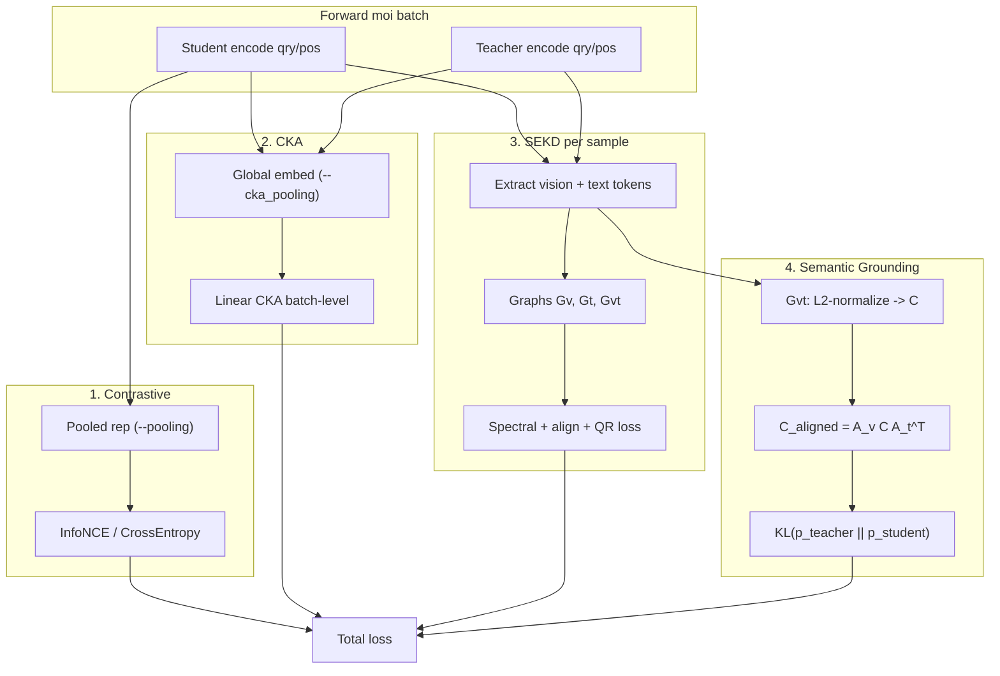
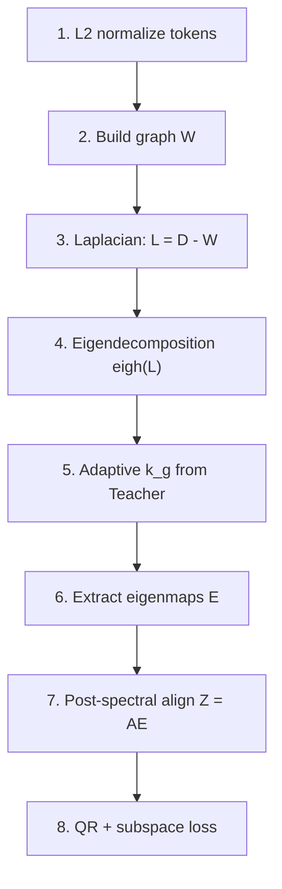
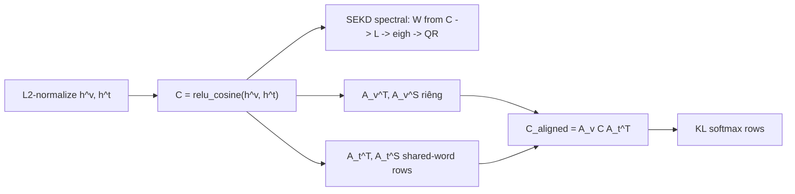

# SEGDLoss — Tổng quan loss (Multimodal Spectral Eigenspace Distillation)

Tài liệu theo dõi cấu trúc loss hiện tại của [`src/criterions/segd_loss.py`](../src/criterions/segd_loss.py).  
Phương pháp distillation phổ chính: **SEKD** (Spectral Eigenspace Knowledge Distillation), chạy **per-sample** trên native tokens; alignment chỉ sau phân tích phổ.  
Bổ sung **Semantic Grounding Distillation**: KL trên ma trận affinity vision–text **đã align** về lưới $H_0 \times W_0$ × shared words (song song SEKD, không thay thế).

Script train mẫu: [`scripts/cls/train_SEGD_fastvlm.sh`](../scripts/cls/train_SEGD_fastvlm.sh)

---

## Công thức tổng

```
loss = contrastive_loss
     + kd_weight * segd_loss
     + kd_weight * w_loss_cka * cka_loss
     + kd_weight * w_loss_grounding_effective * grounding_loss
```

`w_loss_grounding_effective` = `w_loss_grounding` sau linear warmup (§4, `--w_loss_grounding_warmup_steps`). Khi warmup = 0, bằng `w_loss_grounding` cố định.

| Thành phần | Trọng số mặc định | Mô tả ngắn |
|------------|-------------------|------------|
| `contrastive_loss` | 1.0 (implicit) | InfoNCE trên pooled embedding student (query ↔ positive) |
| `segd_loss` | `kd_weight` | SEKD: distillation phổ Laplacian per-sample (qry + pos) |
| `cka_loss` | `kd_weight * w_loss_cka` | Linear CKA batch-level trên global embedding student ↔ teacher |
| `grounding_loss` | `kd_weight * w_loss_grounding_effective` | KL trên $C_{\mathrm{aligned}}$ (affinity $\mathcal{G}_{vt}$ sau align $A_v C A_t^{\top}$) |

**Không có:** RKD, local cross-modal affinity, DBSCAN vision cluster, pre-alignment hidden states teacher→student.

---

## Luồng tính toán tổng thể



---

## 1. Contrastive loss

### Mục tiêu

Học alignment retrieval: embedding query student phải gần positive tương ứng và xa các positive khác trong batch (và across GPUs nếu DDP).

### Input

- **Chỉ student:** `student_qry_reps`, `student_pos_reps` từ `student_model.encode_input(...)`.
- Teacher **không** tham gia contrastive.

### Vector đại diện (pooling)

Lấy hidden layer cuối $H^{(L)} \in \mathbb{R}^{S \times D}$, pool theo `--pooling` (`last` hoặc `eos` — **cùng logic**).

**Right padding** (student, format `[vision][text][pad]`):

Số token pad của sample $i$:

$$
n_i^{\mathrm{pad}} = \sum_{t=1}^{S} \mathbf{1}\!\left[m_{i,t} = 0\right]
$$

Index token thật cuối cùng (trước pad):

$$
t_i^{\ast} = S - n_i^{\mathrm{pad}} - 1
$$

Vector đại diện (một hàng của tensor hidden):

$$
r_i = H^{(L)}[i,\; t_i^{\ast},\; :]
$$

**Left padding** (nếu có):

$$
r_i = H^{(L)}[i,\; S-1,\; :]
$$

Nếu `--normalize True`:

$$
e_i = \frac{r_i}{\|r_i\|_2}
$$

Kết quả: $E^{\mathrm{qry}} \in \mathbb{R}^{B \times D}$, $E^{\mathrm{pos}} \in \mathbb{R}^{B \times D}$.

> **Lưu ý:** Contrastive dùng `--pooling`, **không** dùng `--cka_pooling`. Hiện chỉ hỗ trợ `last`/`eos` (không có `mean` trong `MMEBModel._pooling`).

### Similarity & InfoNCE

Ma trận similarity (dot product = cosine nếu đã normalize):

$$
S_{ij} = \left(e^{\mathrm{qry}}_i\right)^{\!\top} e^{\mathrm{pos}}_j
$$

Multi-GPU: `all_gather` query và positive → $S \in \mathbb{R}^{B_g \times B_g}$.

Temperature $\tau$ = `distiller.temperature` (mặc định `0.02`):

$$
\mathcal{L}_{\mathrm{contrastive}}
= -\frac{1}{B_q}\sum_{i=0}^{B_q-1}
\log
\frac{
  \exp\!\left(S_{i,\, t_i} / \tau\right)
}{
  \sum_{j=0}^{B_p-1} \exp\!\left(S_{i,j} / \tau\right)
}
$$

Label $t_i = i \cdot (B_q / B_p)$ khi batch cân.

**Metric log:** `contrastive_loss`

---

## 2. CKA loss (batch-level)

### Mục tiêu

Ép student và teacher có **cùng cấu trúc hình học** trên batch các global embedding (linear CKA).

### Input

- Hidden layer cuối student và teacher (cùng forward với SEKD).
- Pool độc lập qua `--cka_pooling` (không dùng `encode_input` reps).

### Global embedding (`pool_global_embedding`)

Cho mỗi sample, từ $H^{(L)} \in \mathbb{R}^{S \times D}$ và `attention_mask` $m \in \{0,1\}^S$:

| `cka_pooling` | Công thức |
|---------------|-----------|
| `last` / `eos` | Giống contrastive pooling (token cuối không pad) |
| `mean` | $g = \dfrac{\sum_t m_t \, H^{(L)}_t}{\sum_t m_t}$ (masked mean vision + text) |

Sau đó L2-normalize nếu `--normalize` (student) / `--teacher_normalize` (teacher).

Teacher embedding luôn `.detach()`.

### Linear CKA

Với batch $B$ sample, ma trận $S_H \in \mathbb{R}^{B \times D_s}$, $T_H \in \mathbb{R}^{B \times D_t}$.

Center theo cột (mean trên batch):

$$
\tilde{S}_H = S_H - \mathbf{1}\,\mu_{S_H}^{\top}
$$

$$
\tilde{T}_H = T_H - \mathbf{1}\,\mu_{T_H}^{\top}
$$

$$
\mathrm{CKA}(\tilde{S}_H, \tilde{T}_H)
=
\frac{
  \left\|\tilde{S}_H^{\top} \tilde{T}_H\right\|_F
}{
  \sqrt{
    \left\|\tilde{S}_H^{\top} \tilde{S}_H\right\|_F
    \cdot
    \left\|\tilde{T}_H^{\top} \tilde{T}_H\right\|_F
  }
}
$$

$$
\mathcal{L}_{\mathrm{CKA}}^{\mathrm{side}}
= 1 - \mathrm{CKA}(\tilde{S}_H, \tilde{T}_H)
$$

Tổng:

$$
\mathcal{L}_{\mathrm{CKA}}
= \mathcal{L}_{\mathrm{CKA}}^{\mathrm{qry}}
+ \mathcal{L}_{\mathrm{CKA}}^{\mathrm{pos}}
$$

**Gradient:** chỉ student nhận gradient qua CKA.

**Metric log:** `cka_loss`

### So sánh pooling CKA vs Contrastive

| | Contrastive | CKA |
|---|-------------|-----|
| Tham số | `--pooling` | `--cka_pooling` |
| Model | Chỉ student | Student + teacher |
| `last`/`eos` + cùng normalize | **Trùng vector** trên student (cùng $H^{(L)}$, cùng mask) | |
| `mean` CKA | Khác contrastive | |

---

## 3. SEKD loss (`segd_loss`)

### Mục tiêu

Distill **hình học phổ** (spectral geometry) của tokens qua Laplacian eigenspace, với alignment **sau** eigendecomposition (post-spectral).

### Phạm vi

- Chạy **độc lập từng sample** (không gộp batch thành một đồ thị lớn).
- Query và positive tính riêng, rồi average:

$$
\mathcal{L}_{\mathrm{SEKD}}
= \frac{1}{2}
\left(
  \mathcal{L}_{\mathrm{SEKD}}^{\mathrm{qry}}
  + \mathcal{L}_{\mathrm{SEKD}}^{\mathrm{pos}}
\right)
$$

Mỗi side: average trên các sample có ≥ 1 graph hợp lệ.

### 3.1 Trích xuất token (native, không pre-align)

Từ hidden layer cuối, **không** cluster DBSCAN, **không** map teacher→student trên hidden:

| Modality | Teacher | Student |
|----------|---------|---------|
| Vision | `extract_vision_hidden_states` — toàn bộ patch tokens | idem |
| Text | `extract_text_hidden_states` — toàn bộ subword tokens | idem |

Text offsets (`build_paired_text_offsets`) và vision grid (`build_vision_alignment_operator`) dùng cho:
- **Post-spectral text/vision alignment** (eigenmap $Z = AE$),
- **Semantic Grounding** ($C_{\mathrm{aligned}} = A_v C A_t^{\top}$).

Không ghép số token teacher = student trên hidden states.

### 3.2 Pipeline SEKD cho mỗi graph $g \in \{v,\, t,\, vt\}$



#### Bước 1 — Token normalization

$$
\bar{h}_i = \frac{h_i}{\|h_i\|_2}
$$

Áp dụng riêng cho teacher $T$ và student $S$.

#### Bước 2 — Xây đồ thị modality-specific

**a) $\mathcal{G}_v$ (vision–vision) và $\mathcal{G}_t$ (text–text):**

- kNN trên cosine/L2 của tokens đã normalize.
- **Symmetric union neighborhood:** cạnh $(i,j)$ tồn tại nếu $i \in \mathcal{N}_k(j)$ **hoặc** $j \in \mathcal{N}_k(i)$.
- Trọng số self-tuning heat-kernel:

$$
w_{ij}
= \exp\!\left(
  -\frac{\|\bar{h}_i - \bar{h}_j\|_2^2}{\sigma_i \sigma_j + \epsilon}
\right)
$$

$\sigma_i$ = khoảng cách tới neighbor thứ $k$ của node $i$ (kNN selection **detach**, weights differentiable w.r.t. student $h$).

**b) $\mathcal{G}_{vt}$ (bipartite vision–text):**

$$
c_{ij} = \max\!\left(0,\; \left(\bar{h}_i^{v}\right)^{\!\top} \bar{h}_j^{t}\right)
$$

$$
W =
\begin{bmatrix}
0 & C \\
C^{\top} & 0
\end{bmatrix}
$$

> **Lưu ý:** Cùng ma trận $C$ được tính sau bước normalize cũng là input cho **Semantic Grounding** (nhánh song song, align trước KL — xem §4). Nhánh spectral vẫn dùng $C$ thô để build $W$ và Laplacian.

#### Bước 3 — Laplacian & eigendecomposition

Laplacian không chuẩn hóa:

$$
L = D - W,
\qquad
D_{ii} = \sum_j W_{ij}
$$

Phân tích giá trị riêng đối xứng (`torch.linalg.eigh`):

$$
L = U \Lambda U^{\top},
\qquad
0 \le \lambda_1 \le \lambda_2 \le \cdots
$$

- Bỏ qua eigenvalue null: $\lambda_r \le \epsilon_{\mathrm{eig}}$ → đếm $c$ null eigenvalues.
- **Adaptive dimension** (chỉ trên **Teacher**, detach):

$$
\Delta_m = \lambda_{T,\, c+m} - \lambda_{T,\, c+m-1}
$$

$$
k_g = \arg\max_{m \in [k_{\min},\, k_{\max}^{\mathrm{eff}}]} \Delta_m
$$

Ở đây $m$ là **số lượng** eigenvector được chọn (không phải index). Gap $\Delta_m$ được đo ngay sau vector thứ $m$ trong tập bắt đầu từ $u_c$: giữa $u_{c+m-1}$ và $u_{c+m}$. $k_g = m$ tối ưu sao cho tập $[u_c, \ldots, u_{c+k_g-1}]$ dừng ngay trước vách gap lớn nhất trong phạm vi.

- Eigenmap:

$$
E = \left[ u_{c},\; u_{c+1},\; \ldots,\; u_{c+k_g-1} \right]
\in \mathbb{R}^{N \times k_g}
$$

Student dùng cùng $k_g$ (cắt nếu spectrum student ngắn hơn).

#### Bước 4 — Post-spectral alignment

**Không align hidden states.** Chỉ align **eigenmaps** qua ma trận $A$:

$$
Z = A \, E
$$

| Graph | Alignment |
|-------|-----------|
| **Vision** | Reshape eigen-cột thành map $H \times W$, bilinear interpolate về lưới chung $H_0 \times W_0$ (mặc định 10×10) |
| **Text** | $A_{r,i} = \dfrac{\left\|[a_r,b_r) \cap [s_i,e_i)\right\|}{b_r - a_r}$ trên shared words |
| **Bipartite** | $Z = \mathrm{blkdiag}(A_v,\, A_t)\, E$ |

#### Bước 5 — QR factorization & subspace loss

Vì interpolation làm mất trực giao, reduced QR trên không gian đã align:

$$
Z = Q R
$$

Principal-angle subspace loss:

$$
\mathcal{L}_g = 1 - \frac{1}{k}\,\left\|Q_T^{\top} Q_S\right\|_F^2
$$

$Q_T$ **detach**; gradient student qua $Q_S \leftarrow Z_S \leftarrow E_S \leftarrow L_S \leftarrow W_S \leftarrow$ tokens.

### 3.3 Tổng hợp per-sample

Cho sample có các graph hợp lệ $\mathcal{G}$ với trọng số $\lambda_g$:

$$
\mathcal{L}_{\mathrm{eig}}^{\mathrm{sample}}
=
\frac{
  \sum_{g \in \mathcal{G}} \lambda_g \, \mathcal{L}_g
}{
  \sum_{g \in \mathcal{G}} \lambda_g
}
$$

| Graph | Trọng số $\lambda_g$ | Điều kiện tối thiểu |
|-------|----------------------|---------------------|
| $\mathcal{G}_v$ | `w_loss_v` | ≥ 2 vision tokens (T & S) |
| $\mathcal{G}_t$ | `w_loss_t` | ≥ 2 text tokens + text offsets hợp lệ |
| $\mathcal{G}_{vt}$ | `w_loss_cross` | ≥ 1 vision + ≥ 1 text + alignment matrices OK; tổng nodes ≥ 3 |

Sample không có graph hợp lệ → đóng góp 0 (DDP-safe).

**Metric log:** `segd_loss`, `segd_loss_qry`, `segd_loss_pos`, `sekd_mean_k_g`, `sekd_mean_k_g_qry`, `sekd_mean_k_g_pos`

---

## 4. Semantic Grounding loss (`grounding_loss`)

### Mục tiêu

Bổ sung ràng buộc **trực tiếp** trên correspondence vision–text trong **không gian đã align** (lưới $H_0 \times W_0$ × shared words), ép phân phối softmax của student khớp teacher — bổ sung cho SEKD spectral, không thay thế.

### Pipeline (trong block $\mathcal{G}_{vt}$)



Hàm code: `align_bipartite_affinity_for_grounding(c, a_v, a_t)` → `semantic_grounding_kl_loss(...)`.

### Vì sao cần align trước KL?

Teacher (`patch_size=28`) và student (`patch_size=64`) có $N_v$, $N_t$ native khác nhau. KL trực tiếp trên $C_{ij}$ thô $[N_v, N_t]$ là **sai ngữ nghĩa** (hàng/cột index không tương ứng cùng vùng ảnh/từ). Giải pháp: tái dùng $A_v$, $A_t$ của post-spectral SEKD:

$$
C_{\mathrm{aligned}} = A_v \, C \, A_t^{\top}
\quad\in\mathbb{R}^{(H_0 W_0)\times M}
$$

| Operator | Shape | Nguồn | Teacher / Student |
|----------|-------|-------|-------------------|
| $A_v$ | $[H_0 W_0,\, N_v]$ | `build_vision_alignment_operator` | **Riêng** (patch grid / $N_v$ khác) |
| $A_t$ | $[M,\, N_t]$ | `build_joint_text_alignment_matrices` | **Riêng cột**, cùng $M$ shared-word rows |
| $C$ | $[N_v,\, N_t]$ | `bipartite_relu_cosine_matrix` | Riêng native tokens |
| $C_{\mathrm{aligned}}$ | $[H_0 W_0,\, M]$ | $A_v C A_t^{\top}$ | **Cùng shape** T/S trước KL |

Ma trận $C$ gốc vẫn dùng **nguyên vẹn** cho nhánh spectral $\mathcal{G}_{vt}$ (Laplacian / eigh).

### Input

- $C$ từ $\mathcal{G}_{vt}$ sau L2-normalize (`bipartite_relu_cosine_matrix`); teacher $C$ tính trong `no_grad`.
- $A_v$, $A_t$: geometry-only (không grad từ hidden).
- Gradient student: $C_{\mathrm{aligned}}^{S} = A_v^{S}\, C^{S}\, (A_t^{S})^{\top}$ → softmax/KL.

Trước KL, code kiểm tra `C_aligned_teacher.shape == C_aligned_student.shape` (`__debug__` assert; production trả 0 nếu lệch).

### Điều kiện sample

Cùng điều kiện tối thiểu block $\mathcal{G}_{vt}$ trong code:

- Có ảnh (`has_image`), ≥ 1 vision token và ≥ 1 text token (teacher & student),
- `a_t_teacher`, `a_t_student` hợp lệ (`build_joint_text_alignment_matrices`),
- `a_v_teacher`, `a_v_student` build OK (`build_vision_alignment_operator`),
- `w_loss_grounding > 0`.

Sample không đủ điều kiện → đóng góp 0 (DDP-safe, giống SEKD).

### Công thức

Với mỗi hàng vision-grid $i$ (trên $C_{\mathrm{aligned}}$):

$$
p^{\mathrm{teacher}}_{i\cdot} = \mathrm{softmax}_j\!\left(\frac{C_{\mathrm{aligned},\, ij}^{\mathrm{teacher}}}{\tau_{\mathrm{ground}}}\right),
\qquad
p^{\mathrm{student}}_{i\cdot} = \mathrm{softmax}_j\!\left(\frac{C_{\mathrm{aligned},\, ij}^{\mathrm{student}}}{\tau_{\mathrm{ground}}}\right)
$$

$$
\mathcal{L}^{\mathrm{sample}}_{\mathrm{ground}}
= \mathrm{mean}_i\,
\mathrm{KL}\!\left(p^{\mathrm{teacher}}_{i\cdot} \,\|\, p^{\mathrm{student}}_{i\cdot}\right)
$$

Nếu `--sekd_grounding_bidirectional True` (mặc định), thêm chiều text→vision trên $C_{\mathrm{aligned}}^{\top}$ rồi average.

Tổng hợp query / positive:

$$
\mathcal{L}_{\mathrm{ground}}
= \frac{1}{2}\left(\mathcal{L}^{\mathrm{qry}}_{\mathrm{ground}} + \mathcal{L}^{\mathrm{pos}}_{\mathrm{ground}}\right)
$$

### Hyperparameters

| Arg | CLI | Default | Ý nghĩa |
|-----|-----|---------|---------|
| `w_loss_grounding` | `--w_loss_grounding` | `0.5` | Trọng số target sau `kd_weight` |
| `w_loss_grounding_warmup_steps` | `--w_loss_grounding_warmup_steps` | `0` | Warmup steps cố định (override ratio) |
| `w_loss_grounding_warmup_ratio` | `--w_loss_grounding_warmup_ratio` | `0` | `0.15` = warmup 15% total steps (khi steps = 0) |
| `sekd_grounding_temp` | `--sekd_grounding_temp` | `0.1` | $\tau_{\mathrm{ground}}$ (temperature thấp → softmax nhọn; spike sớm có thể thử `0.2`–`0.3` qua CLI) |
| `sekd_grounding_bidirectional` | `--sekd_grounding_bidirectional` | `True` | KL hai chiều v↔t |

**Warmup (runtime):** Nếu `w_loss_grounding_warmup_steps > 0`, dùng trực tiếp. Nếu không, `warmup_steps = max(1, floor(ratio × max_train_steps))` với `w_loss_grounding_warmup_ratio` (vd. `0.15`). `w_loss_grounding_effective(step) = w_loss_grounding × min(1, step / warmup_steps)`.

### Metric log keys

| Key | Ý nghĩa |
|-----|---------|
| `grounding_loss` | Tổng weighted (qry + pos) / 2 |
| `grounding_loss_qry` | Side query (detached) |
| `grounding_loss_pos` | Side positive (detached) |
| `grounding_valid_samples_qry` | Số sample hợp lệ (qry) |
| `grounding_valid_samples_pos` | Số sample hợp lệ (pos) |

---

## 5. Ràng buộc gradient & DDP

| Thành phần | Teacher gradient | Student gradient |
|------------|------------------|------------------|
| Contrastive | ✗ | ✓ (pooled rep) |
| CKA | ✗ (detach) | ✓ (global embed) |
| SEKD spectral Teacher | ✗ (detach $E_T$, $Q_T$, $\lambda_T$, $k_g$) | ✓ (QR path) |
| Grounding $C_{\mathrm{aligned}}$ teacher | ✗ (detach $C^T$ và output aligned) | ✓ (qua $C^S \to C_{\mathrm{aligned}}^S$) |
| $A_v$, $A_t$ (geometry) | ✗ (constant) | ✗ |
| kNN indices, nullity, eigengap | ✗ (no_grad) | ✗ |

**DDP:** Sample invalid được zero-out; aggregation dùng `sum(loss) / valid_samples` để tránh deadlock khi số graph khác nhau giữa rank.

---

## Hyperparameters

Nguồn: [`src/arguments.py`](../src/arguments.py), [`scripts/cls/train_SEGD_fastvlm.sh`](../scripts/cls/train_SEGD_fastvlm.sh).

### Chung

| Arg | CLI | Default (script) | Ý nghĩa |
|-----|-----|------------------|---------|
| `kd_loss_type` | `--kd_loss_type` | `segd_loss` | Chọn criterion |
| `kd_weight` | `--kd_weight` | `0.05` | Scale `segd_loss`, `cka_loss`, `grounding_loss` |

### Contrastive (model-level)

| Arg | CLI | Default | Ý nghĩa |
|-----|-----|---------|---------|
| `pooling` | `--pooling` | `eos` | Pooling student (`last` ≡ `eos`) |
| `normalize` | `--normalize` | `True` | L2 norm embedding student |
| `temperature` | `--temperature` | `0.02` | InfoNCE temperature |

### CKA

| Arg | CLI | Default | Ý nghĩa |
|-----|-----|---------|---------|
| `w_loss_cka` | `--w_loss_cka` | `1.0` | Trọng số CKA sau `kd_weight` |
| `cka_pooling` | `--cka_pooling` | `last` | `mean` hoặc `last`/`eos` |
| `teacher_normalize` | `--teacher_normalize` | `True` | L2 norm teacher CKA embed |

### SEKD

| Arg | CLI | Default | Ý nghĩa |
|-----|-----|---------|---------|
| `w_loss_v` | `--w_loss_v` | `1.0` | Trọng số graph vision |
| `w_loss_t` | `--w_loss_t` | `0.7` | Trọng số graph text |
| `w_loss_cross` | `--w_loss_cross` | `1.0` | Trọng số graph bipartite |
| `knn_neighbors` | `--knn_neighbors` | `10` | $k$ cho kNN (v-v, t-t) |
| `sekd_k_min` | `--sekd_k_min` | `2` | $k_{\min}$ adaptive eigengap |
| `sekd_k_max` | `--sekd_k_max` | `16` | $k_{\max}$ adaptive eigengap |
| `sekd_eig_eps` | `--sekd_eig_eps` | `1e-6` | Ngưỡng null eigenvalue |
| `sekd_align_grid_h` | `--sekd_align_grid_h` | `10` | $H_0$ lưới vision chung |
| `sekd_align_grid_w` | `--sekd_align_grid_w` | `10` | $W_0$ lưới vision chung |
| `w_loss_grounding` | `--w_loss_grounding` | `0.5` | Trọng số Semantic Grounding (target) |
| `w_loss_grounding_warmup_steps` | `--w_loss_grounding_warmup_steps` | `0` | Warmup steps cố định; nếu `> 0` thì bỏ qua ratio |
| `w_loss_grounding_warmup_ratio` | `--w_loss_grounding_warmup_ratio` | `0` | Warmup = ratio × total optimizer steps (vd. `0.15` = 15%) khi steps = 0 |
| `sekd_grounding_temp` | `--sekd_grounding_temp` | `0.1` | $\tau_{\mathrm{ground}}$ |
| `sekd_grounding_bidirectional` | `--sekd_grounding_bidirectional` | `True` | KL hai chiều v↔t |
| `teacher_patch_size` | `--teacher_patch_size` | `28` | Suy ra grid vision teacher |
| `student_patch_size` | `--student_patch_size` | `64` | Suy ra grid vision student |

---

## `loss_dict` — keys từ `forward()`

### Loss chính (backprop)

| Key | Công thức trong total loss |
|-----|---------------------------|
| `loss` | Tổng weighted |
| `contrastive_loss` | $\mathcal{L}_{\mathrm{contrastive}}$ |
| `cka_loss` | $\mathcal{L}_{\mathrm{CKA}}$ |
| `segd_loss` | $\mathcal{L}_{\mathrm{SEKD}}$ |
| `grounding_loss` | $\mathcal{L}_{\mathrm{ground}}$ |

### Metrics theo dõi

| Key | Ý nghĩa |
|-----|---------|
| `segd_loss_qry` | SEKD side query (detached) |
| `segd_loss_pos` | SEKD side positive (detached) |
| `grounding_loss_qry` | Grounding side query (detached) |
| `grounding_loss_pos` | Grounding side positive (detached) |
| `grounding_weight_effective` | `w_loss_grounding` sau warmup tại step hiện tại |
| `grounding_to_segd_ratio` | `(grounding_loss × effective_w) / segd_loss` (giám sát cân bằng) |
| `batch_vision_nodes_qry` | Tổng vision tokens student (qry) |
| `batch_text_nodes_qry` | Tổng text tokens student (qry) |
| `batch_vision_nodes_pos` | Tổng vision tokens student (pos) |
| `batch_text_nodes_pos` | Tổng text tokens student (pos) |
| `sekd_valid_graphs_qry` | Số graph hợp lệ (qry) trong batch |
| `sekd_valid_graphs_pos` | Số graph hợp lệ (pos) trong batch |
| `grounding_valid_samples_qry` | Sample grounding hợp lệ (qry) |
| `grounding_valid_samples_pos` | Sample grounding hợp lệ (pos) |
| `sekd_mean_k_g` | Trung bình $k_g$ eigenvectors / batch (cả qry+pos) |
| `sekd_mean_k_g_qry` | Trung bình $k_g$ (qry) |
| `sekd_mean_k_g_pos` | Trung bình $k_g$ (pos) |

Định nghĩa log keys: `KD_LOSS_METRIC_KEYS["segd_loss"]` trong [`main.py`](../main.py).

---

## Ví dụ hệ số thực tế (script mặc định)

Với `KD_WEIGHT=0.05`, `W_LOSS_CKA=1.0`, `W_LOSS_GROUNDING=0.5`:

```
loss = contrastive
     + 0.05 * segd_loss
     + 0.05 * 1.0 * cka_loss
     + 0.05 * 0.5 * grounding_loss
```

---

## File liên quan

| File | Nội dung |
|------|----------|
| `src/criterions/segd_loss.py` | `SEGDLoss`, SEKD helpers, `align_bipartite_affinity_for_grounding`, `semantic_grounding_kl_loss`, `CKALoss` |
| `src/criterions/sgd_loss.py` | Text offset helpers (reuse, không dùng cluster/pre-align) |
| `src/model/model.py` | `encode_input`, `_pooling` (contrastive) |
| `src/arguments.py` | CLI hyperparameters |
| `src/criterions/__init__.py` | Registry `segd_loss` |
| `main.py` | Training loop, W&B metrics |
| `scripts/cls/train_SEGD_fastvlm.sh` | Script train mẫu |

---

## So sánh với `sgd_loss` (legacy)

| | `sgd_loss` | `segd_loss` |
|---|------------|-------------|
| RKD | ✓ | ✗ |
| Local cross-modal KL | ✓ | ✗ |
| Batch-level Grassman spectral | ✓ | ✗ |
| DBSCAN / pre-align hidden | ✓ | ✗ |
| SEKD per-sample post-spectral | ✗ | ✓ |
| Semantic Grounding (aligned $C_{\mathrm{aligned}}$ KL) | ✗ | ✓ |
| CKA batch-level | ✗ (đã xóa) | ✓ (có `--cka_pooling`) |
