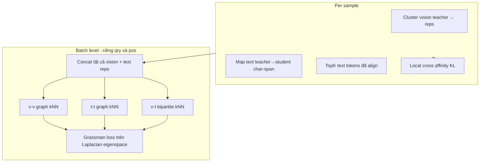

# SGDLoss — Tổng quan loss

Tài liệu theo dõi cấu trúc loss hiện tại của [`src/criterions/sgd_loss.py`](../src/criterions/sgd_loss.py).  
Cập nhật lần cuối: thêm **local cross-modal affinity loss** + **weighted char-span text mapping**.

---

## Công thức tổng

```
loss = contrastive_loss
     + (kd_weight / 10) * rkd_loss
     + kd_weight * spectral_loss
     + kd_weight * w_loss_local_cross * local_cross_loss
```

| Thành phần | Trọng số mặc định | Mô tả ngắn |
|------------|-------------------|------------|
| `contrastive_loss` | 1.0 (implicit) | InfoNCE trên embedding pooled query ↔ positive |
| `rkd_loss` | `kd_weight / 10` | Relational KD (distance + angle) trên rep pooled |
| `spectral_loss` | `kd_weight` | Grassman / Laplacian spectral KD ở batch level |
| `local_cross_loss` | `kd_weight * w_loss_local_cross` | KL distillation phân phối vision↔text affinity trong từng sample |

---

## 1. Contrastive loss

- **Input:** `student_qry_reps`, `student_pos_reps` (sau `encode_input`, có gather multi-GPU).
- **Cách tính:** `CrossEntropyLoss` trên ma trận similarity / `temperature`.
- **Mục tiêu:** Học alignment retrieval — query khớp positive trong batch (và across GPUs nếu DDP).

**Metric log:** `contrastive_loss`

---

## 2. RKD loss (Relational Knowledge Distillation)

Gồm 2 phần, average:

| Sub-loss | Hàm | Ý nghĩa |
|----------|-----|----------|
| `rkd_distance_loss` | `compute_distance_loss` | Huber trên pairwise distance giữa các sample (qry+pos), student vs teacher |
| `rkd_angle_loss` | `compute_angle_loss` | Huber trên góc (cosine) giữa các cặp vector, student vs teacher |

```
rkd_loss = (rkd_distance_loss + rkd_angle_loss) / 2
```

- **Input:** pooled reps của student và teacher (qry + pos concat).
- **Trọng số trong total:** `kd_weight / 10` (mặc định `kd_weight=1` → hệ số 0.1).

**Metric log:** `rkd_loss`  
*(Chi tiết `rkd_distance_loss`, `rkd_angle_loss` chỉ xuất hiện trong NaN debug dump, không log W&B mỗi step.)*

---

## 3. Spectral loss (unified batch-level Grassman KD)

Thay thế loss cũ:
- ~~`token_level_loss`~~ (Grassman per-sample)
- ~~`batch_level_loss`~~ (CKA trên pooled reps)

### Luồng tính



1. **Per sample:** cluster vision (DBSCAN) + weighted cluster mean; map text teacher→student bằng char-span overlap có trọng số; top-k trên tensor đã align; tính `local_cross_loss` (xem §4).
2. **Batch (qry / pos tách riêng):** concat reps → build 3 đồ thị teacher & student.
3. **Grassman loss:** `||Π_teacher − Π_student||²_F` trên eigenspace Laplacian.
4. **Average** loss giữa side `qry` và `pos`.

### Ba thành phần spectral

| Key | Đồ thị | Điều kiện tối thiểu |
|-----|--------|---------------------|
| `spectral_loss_v` | Vision–vision (kNN trên cluster reps batch) | ≥ 2 vision nodes / side |
| `spectral_loss_t` | Text–text (kNN trên topk text reps batch) | ≥ 2 text nodes / side |
| `spectral_loss_cross` | Vision–text bipartite (kNN 2 chiều, full batch) | ≥ 3 nodes tổng (v+t) / side |

```
spectral_loss_side = w_loss_v * L_v + w_loss_t * L_t + w_loss_cross * L_cross
spectral_loss = mean(spectral_loss_qry, spectral_loss_pos)
```

### Hyperparameters spectral (`arguments.py`)

| Arg | Default | Ý nghĩa |
|-----|---------|---------|
| `kd_weight` | 1.0 | Nhân cho `spectral_loss`, `local_cross_loss` (và `/10` cho RKD) |
| `w_loss_v` | 1.0 | Trọng số vision spectral |
| `w_loss_t` | 1.0 | Trọng số text spectral |
| `w_loss_cross` | 1.0 | Trọng số cross-modal spectral |
| `grassman_vision_use_cluster` | false | Cluster vision vs dùng toàn bộ tokens |
| `grassman_text_use_topk` | false | TopK text vs toàn bộ text tokens |
| `topk_text_ratio` | 0.8 | Tỷ lệ topk text |
| `knn_neighbors` | 10 | k cho v-v, t-t, v-t |
| `num_eigenvectors` | 16 | Số eigenvector Laplacian (không tính v₀) |
| `laplacian_type` | `unnormalized` | `unnormalized` hoặc `normalized` |

---

## 4. Local cross-modal affinity loss

Bổ sung **local grounding trong từng sample** — teacher gán text token / cluster ảnh nào quan trọng với nhau; student học cùng phân phối quan hệ mà không cần khớp trực tiếp hidden dimension.

### Input (sau extraction per sample)

| Tensor | Shape | Nguồn |
|--------|-------|-------|
| `V_T`, `V_S` | `[Nv, D_t]`, `[Nv, D_s]` | Vision cluster reps (teacher DBSCAN → map sang student) |
| `T_T`, `T_S` | `[Nt, D_t]`, `[Nt, D_s]` | Top-k text tokens đã align (cùng số hàng teacher/student) |

`Nv`, `Nt` phải khớp giữa teacher và student. `D_t` và `D_s` **không** cần giống nhau.

### Công thức

```
A_T = cos(V_T, T_T) / τ          # [Nv, Nt]
A_S = cos(V_S, T_S) / τ

P_T^{v→t} = softmax(A_T, dim=text)     P_S^{v→t} = softmax(A_S, dim=text)
P_T^{t→v} = softmax(A_T^T, dim=vision)   P_S^{t→v} = softmax(A_S^T, dim=vision)

L_{v→t} = KL(P_T^{v→t} || P_S^{v→t})
L_{t→v} = KL(P_T^{t→v} || P_S^{t→v})

local_cross_loss_sample = 0.5 * (L_{v→t} + L_{t→v})
```

- Teacher distribution `.detach()` — chỉ student nhận gradient.
- Sample bị bỏ nếu `Nv < 2` hoặc `Nt < 2`.
- Average qua các sample hợp lệ trong batch, rồi average `qry` và `pos`.

### Hyperparameters

| Arg | Default | Gợi ý tuning |
|-----|---------|--------------|
| `w_loss_local_cross` | 0.2 | Tăng 0.5 nếu loss quá nhỏ; giảm 0.05–0.1 nếu dao động |
| `local_cross_temperature` | 0.1 | Tăng 0.2 nếu training không ổn định |

**Metric log:** `local_cross_loss`

---

## 5. Text mapping (teacher → student)

Dùng cho cả spectral text nodes và local cross loss. Không ghép index thô `s[i] ↔ t[i]`.

### Pipeline

1. **Đếm text tokens** riêng teacher/student (loại pad/special; student thêm loại `IMAGE_TOKEN_INDEX`).
2. **Cắt hidden** layer cuối:
   - Teacher `[pad][vision][text]` → `hidden[-Nt:]`
   - Student `[vision][text][pad]` → `hidden[Nv:Nv+Ns]`
3. **Build offsets** (`build_paired_text_offsets`):
   - `reference_text` = raw text đã strip image markers
   - Thử cùng candidate string cho cả hai tokenizer
   - **Strict:** `tokenizer(text)` phải reproduce đúng `text_token_ids` từ `input_ids`
   - Cả teacher và student phải thành công trên **cùng** candidate → hệ tọa độ ký tự chung
4. **Weighted align** (`align_student_to_teacher_by_offsets`):
   - Ma trận overlap `[Nt, Ns]` = độ dài char-span giao nhau
   - Mỗi teacher token `i`: `s_aligned[i] = Σ_j w_{ij} * s_hidden[j]`, `w_{ij} ∝ overlap[i,j]`
   - `t_aligned[i] = t_hidden[i]`
5. **Top-k** (`select_topk_text_tokens_by_last_token_cosine`) trên tensor **đã align**; cùng indices cho teacher và student.

### Skip reasons (text)

| `skip_reason` | Khi nào |
|---------------|---------|
| `offset_token_id_mismatch` | Không build được offset khớp `input_ids` |
| `teacher_offset_hidden_length_mismatch` | `len(offsets_t) ≠ Nt` |
| `student_offset_hidden_length_mismatch` | `len(offsets_s) ≠ Ns` |
| `no_character_overlap_pairs` | Ma trận overlap toàn 0 |
| `missing_aligned_text_hidden_states` | Align thất bại |

---

## 6. Vision mapping (teacher → student)

| Mode | `grassman_vision_use_cluster` | Cách map |
|------|-------------------------------|----------|
| Cluster (mặc định train script) | `true` | DBSCAN trên teacher patches → `map_teacher_clusters_to_student` (spatial) → weighted cluster mean |
| Token-level | `false` | `map_teacher_tokens_to_student` — 1 teacher patch → 1 student patch theo tọa độ |

Output: `h_t_v`, `h_s_v` cùng số cluster/node `Nv`.

---

## loss_dict — keys trả về từ `forward()`

### Loss chính

| Key | Backprop? | Ghi chú |
|-----|-----------|---------|
| `loss` | ✓ | Tổng weighted |
| `contrastive_loss` | ✓ | |
| `rkd_loss` | ✓ | |
| `spectral_loss` | ✓ | Combined weighted qry+pos |
| `spectral_loss_v` | ✓* | *Qua `spectral_loss`; log riêng để monitor |
| `spectral_loss_t` | ✓* | |
| `spectral_loss_cross` | ✓* | |
| `local_cross_loss` | ✓ | Per-sample affinity KL; scale `kd_weight * w_loss_local_cross` |

### Metrics theo dõi (không phải loss term riêng)

| Key | Ý nghĩa |
|-----|---------|
| `batch_vision_nodes_qry` | Số đỉnh vision trong đồ thị batch (query) |
| `batch_text_nodes_qry` | Số đỉnh text trong đồ thị batch (query) |
| `batch_vision_nodes_pos` | Số đỉnh vision (positive) |
| `batch_text_nodes_pos` | Số đỉnh text (positive) |

Các metric này log qua `train.log` / W&B mỗi `logging_steps` (xem `KD_LOSS_METRIC_KEYS["sgd_loss"]` trong `main.py`).

---

## Debug (không phải loss)

| Module | Vai trò |
|--------|---------|
| [`src/sgd_debug.py`](../src/sgd_debug.py) | Thu thập & format debug spectral (batch nodes, graph stats) |
| [`src/nan_debug.py`](../src/nan_debug.py) | Ghi file khi NaN hoặc grassman warning |

**Đường dẫn file debug:** `{output_dir}/nan_debug/`  
- `nan_debug.log` — append  
- `events/step_{NNNNNN}_SGD_GRASSMAN_DEBUG.log` — per event  

Chỉ ghi khi loss non-finite hoặc spectral graph / extraction có warning.

---

## File liên quan

| File | Nội dung |
|------|----------|
| `src/criterions/sgd_loss.py` | `SGDLoss`, `local_cross_affinity_loss`, text/vision mapping |
| `src/sgd_debug.py` | Debug session, `build_sgd_loss_dict`, format grassman |
| `src/nan_debug.py` | `log_sgd_forward_debug` → ghi file |
| `src/arguments.py` | CLI hyperparameters |
| `main.py` | `KD_LOSS_METRIC_KEYS`, training loop |
| `scripts/cls/train_SGD_fastvlm.sh` | Script train mẫu (`W_LOSS_LOCAL_CROSS`, `LOCAL_CROSS_TEMPERATURE`) |

---

## Lịch sử thay đổi (tóm tắt)

| Trước | Hiện tại |
|-------|----------|
| `token_level_loss` (Grassman per-sample) | Gộp vào `spectral_loss` (batch-level) |
| `batch_level_loss` (CKA pooled) | **Đã xóa** |
| `w_loss_batch` | **Đã xóa** |
| Text map index-i | **Weighted char-span overlap** (`align_student_to_teacher_by_offsets`) |
| Chỉ batch spectral cross-modal | Thêm **`local_cross_loss`** per-sample affinity KL |
| Log cluster per-sample | Log `batch_*_nodes` + debug file khi warning |
